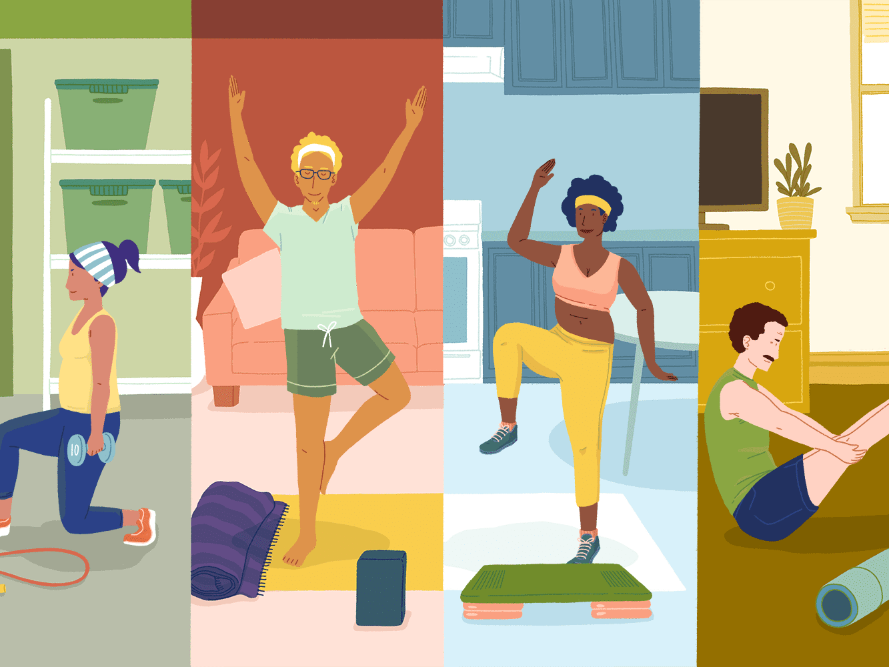
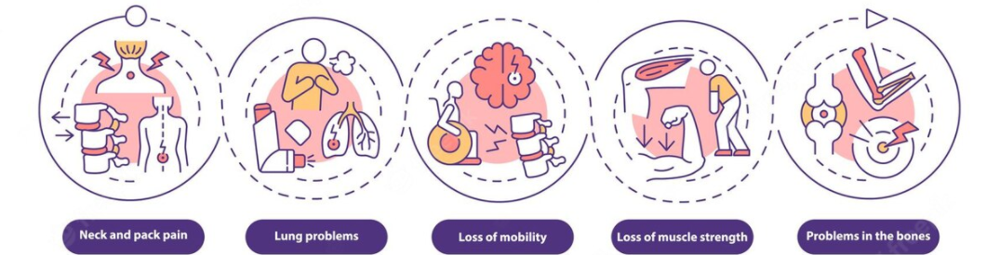
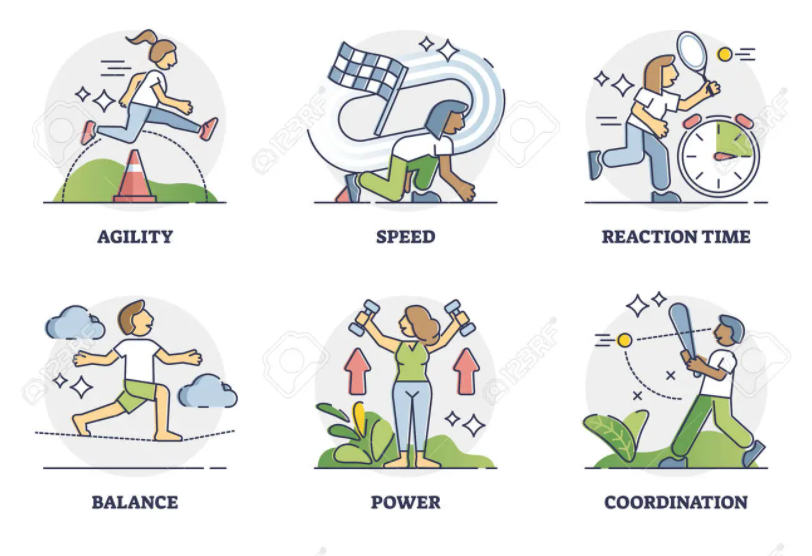

# NTL Hack 2022
 
Repository to hold code for the '*exercise posture analysis*' project that is being presented in an internal hackathon at NextTech Lab Hack 2022.
 

## Problem Inspiration 
 
 
 
The interest in Fitness and Gym is on the rise, and people have started knowing the importance of fitness and health in these trying times. With Gym costly for many  and lack of proper guidance. Injuries have become very frequent. . 
 

## Problem Description 
*What are the problems we face if we don't exercise for a long time?*
 
 
 
 
*What are the benifits we get if we exercise regularly?*
 
 
 
 
There are multiple issues that people face in relation with the exercises, fitness and gym scenario, few of them are given as follows:
- The gym costs a lot of money, time. Many people don't want to pay for a gym membership if they're not going that often.
- Proper feedback and guidance is a must in exercise or else it can lead to painful and sometimes crippling injuries  
- Due to covid, many have opted to do workouts at home. But with , with more than 1000 youtube videos, people find it hard to actually understand the correct technique
 

## Proposed Solution 
Keeping all of this in mind, we came up with a live workout analysis called Physisback. You can now analyze your past workouts or even your current workout and get feedback all from your home. Physiback uses the power of AI and helps users to get a grade on their exercise and also suggestions all from the comfort of their home  
<!--  -->

### Check out the [Project Proposal](https://www.canva.com/design/DAE6Ft86pmE/6XbJ9HAkYR17zx3zRZ6uOg/edit) for our product.

## Features:
- **Auto Feedback**:  You can get Feedback on your exercises about your posture and the corrections required to improve it. 
- **Auto Grading**: Using our calculation, we grade each repetition your perform in your video. 
- **Post-workout analysis**: You can upload your CSV of past workout and analyze it. 
  
## Progress points:
- [x] Develop a basic Streamlit website
- [x] Video input through live feed or recorded video
- [x] Image processing
- [x] Pose estimation
- [x] Repetition analysis 
- [x] Download analysis through CSV 
<i>Extra Feature</i>
- [ ] Multiple angle analysis

## Using the deployed version of the web application
<!-- Please download the <a href = "https://drive.google.com/drive/folders/10RaV7DTsFVgdYeJZIyveyeJKhfvFiKT2?usp=sharing">Model Checkpoints</a> and move the file to the <a href = "https://github.com/aryankargwal/capbot2.0/tree/main/camera">camera</a> folder. -->

- Setting up the Python Environment with dependencies 

        pip install -r requirements.txt
- Cloning the Repository: 

        git clone https://github.com/vvHacker007/NTL_Hack_2022
- Entering the directory for captioning: 

        cd NTL_Hack_2022
- Running the captioning web application:

        streamlit run physio.py
- Stopping the web application from the terminal

        Ctrl+C
        

## License
This project is under the Apache License. See [LICENSE](LICENSE) for Details.

## Contributors

<table>
<tr align="center">
<td>

Abhijeet Jha

</td>

<td>

Aditya Mukherjee

</td>

<td>

Kunal Mundada

</td>

<td>

Vedansh Vijaywargiya

</td>
  </table>
</tr>
  </table>

crafted with &hearts; by team <b>Hum bhi bana lenge</b>

